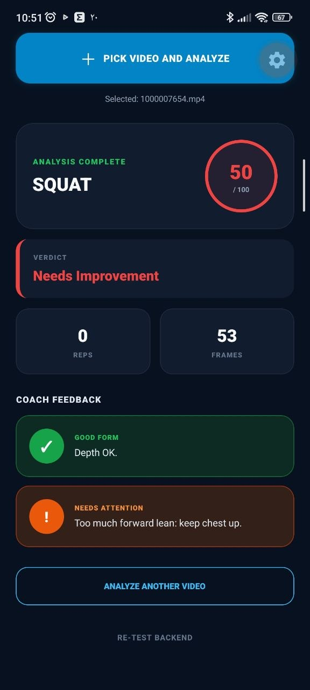
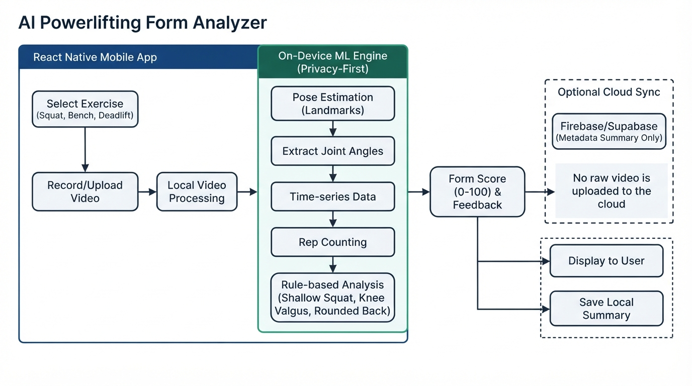
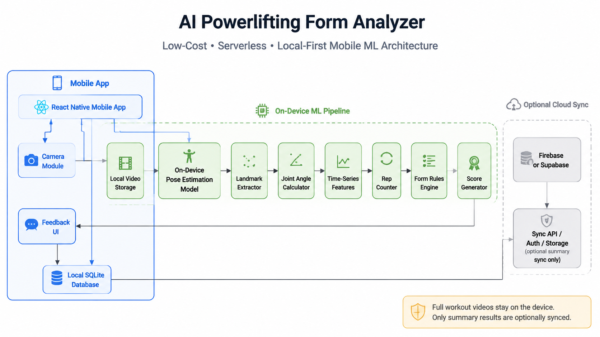

# AI Powerlifting Form Analyzer

> Status: Work in Progress (WIP)

This project is under active development.

## Goal
Build a system that:
1. lets the mobile app upload a powerlifting video,
2. sends the video to the backend API,
3. forwards analysis to an ML service,
4. receives joint angles / movement feedback,
5. returns coaching insights to the mobile app.

## Planned Architecture
- Mobile App (Expo / React Native)
- Backend API (NestJS)
- ML Service (pose / angle / form analysis)

## Current Status
- Backend exists in apps/api
- Mobile app bootstrap is being prepared in apps/mobile
- ML service is planned and will be added next
- Upload / analysis flow is not complete yet

## Development Notes
This repository is being organized incrementally with numbered commits for easier history tracking.

## Next Milestones
- [ ] Stabilize mobile <-> backend connection
- [ ] Add video upload endpoint in backend
- [ ] Add ML service scaffold
- [ ] Connect backend to ML service
- [ ] Return analysis feedback to mobile
- [ ] Improve UI and reporting

## Disclaimer
This repository is currently a work in progress and may not run fully end-to-end yet.

<!-- APP_SHOWCASE_START -->

## Supported Powerlifting Movements

The prototype focuses on the three primary powerlifting movements:
deadlift, squat, and bench press. These images represent the movements
intended for video-based form analysis.

<table>
  <tr>
<td align="center" width="33%">

<br />

</td>
<td align="center" width="33%">

<br />

</td>
<td align="center" width="33%">

<br />

</td>
  </tr>
</table>

> These movement images are representative examples. The application
> and analysis pipeline remain under active development.

## System Architecture

The proposed architecture prioritizes user privacy, efficient video
processing, and clear separation between the mobile, backend, and
machine-learning components.

### Privacy-First System Architecture

<p align="center">
  
</p>

The mobile application communicates with the API backend, which
coordinates authentication, storage, caching, and ML-based movement
analysis. The design aims to minimize unnecessary exposure of user
videos and analysis data.

### Local-First Mobile ML Pipeline

<p align="center">
  
</p>

The local-first pipeline prioritizes processing on the user's device
when possible. Cloud services can provide synchronization and more
computationally intensive analysis when required.

## Android APK Build

The Android APK can be generated with Expo Application Services (EAS)
using the `preview` build profile:

```powershell
cd apps/mobile
npx eas-cli@latest build --platform android --profile preview
```

The `preview` profile creates an APK suitable for direct installation.
The `production` profile creates an Android App Bundle (`.aab`) for
Google Play distribution.

<!-- APP_SHOWCASE_END -->
