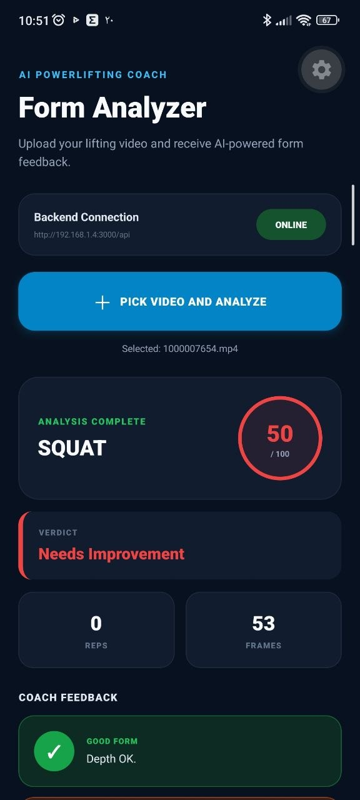
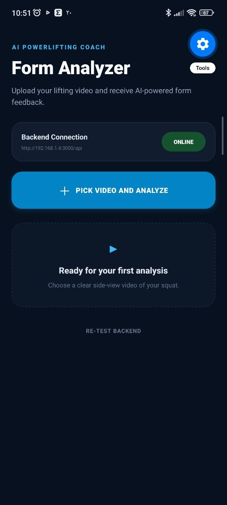

# AI Powerlifting Form Analyzer

> Status: Work in Progress (WIP)

This project is under active development.

## Goal
Build a system that:
1. lets the mobile app upload a powerlifting video,
2. sends the video to the backend API,
3. forwards analysis to an ML service,
4. receives joint angles / movement feedback,
5. returns coaching insights to the mobile app.

## Planned Architecture
- Mobile App (Expo / React Native)
- Backend API (NestJS)
- ML Service (pose / angle / form analysis)

## Current Status
- Backend exists in pps/api
- Mobile app bootstrap is being prepared in pps/mobile
- ML service is planned and will be added next
- Upload / analysis flow is not complete yet

## Development Notes
This repository is being organized incrementally with numbered commits for easier history tracking.

## Next Milestones
- [ ] Stabilize mobile <-> backend connection
- [ ] Add video upload endpoint in backend
- [ ] Add ML service scaffold
- [ ] Connect backend to ML service
- [ ] Return analysis feedback to mobile
- [ ] Improve UI and reporting

## Disclaimer
This repository is currently a work in progress and may not run fully end-to-end yet.

<!-- APP_SHOWCASE_START -->

## Mobile Application

The Expo/React Native mobile application allows users to select a
powerlifting video, send it to the backend and receive form-analysis
feedback.

### Application Screenshots

<p align="center">
  
  
  
</p>

> The screenshots show the current mobile interface. UI and analysis
> capabilities may change while the project is under active development.

## Android APK Build

The downloadable Android APK is generated with Expo Application
Services (EAS) using the `preview` profile:
```powershell
cd apps/mobile
npx eas-cli@latest build --platform android --profile preview

The `preview` profile creates an APK suitable for direct installation.
The `production` profile creates an Android App Bundle (`.aab`) for
Google Play.

<!-- APP_SHOWCASE_END -->
